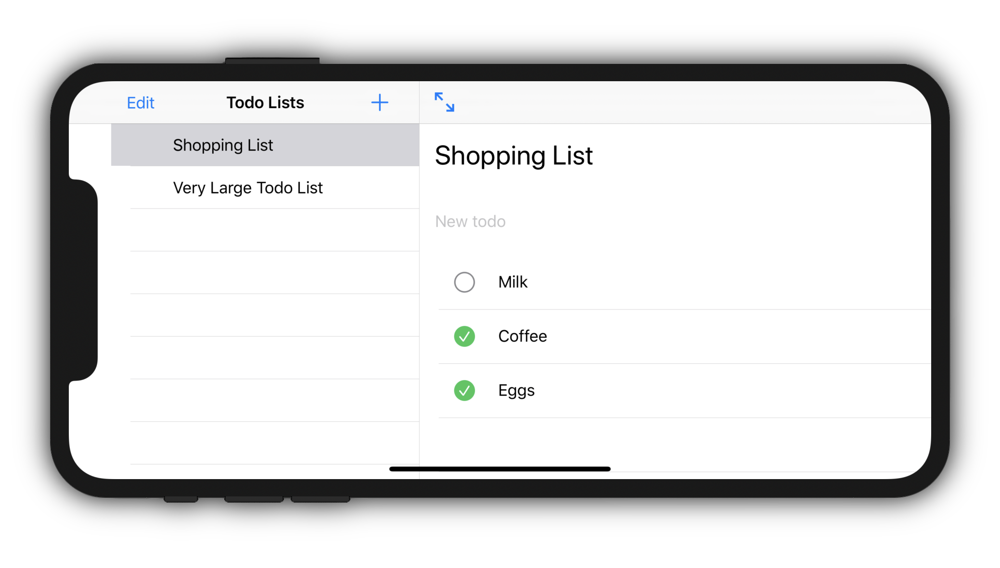
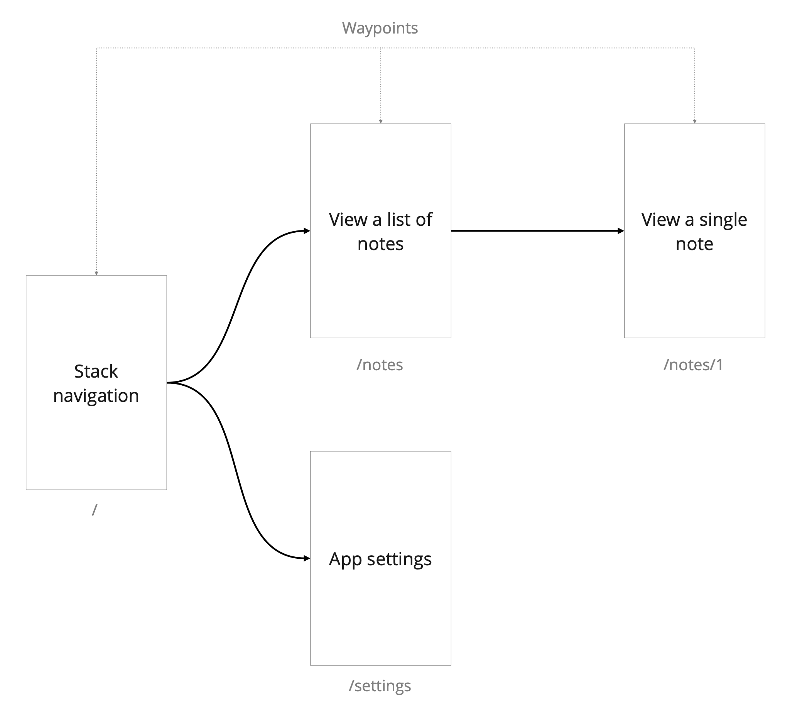

# SwiftDux Navigation

> Provides deep link routing in SwiftUI applications powered by [SwiftDux](https://github.com/StevenLambion/SwiftDux).

[![Swift Version][swift-image]][swift-url]
![Platform Versions][ios-image]

SwiftDux Navigation implements deep-link routing for SwiftUI applications. It's currently in an early development stage.

## Purpose
The purpose of this library is to provide a stateful, deep-link navigational system for an application. In the same way that SwiftUI views represent the application's current state, it does the same for navigation. It's built to be used on its own or in an existing SwiftDux application.

## Live example

[Checkout the SwiftDux Todo Example](https://github.com/StevenLambion/SwiftUI-Todo-Example/tree/swiftdux-navigation).

<div style="text-align:center">
  
</div>

## Getting started
### Use as a standalone
1. Add a SceneRoute to the root of a scene. It will use its own SwiftDux store internally.
```swift
    @main
    struct MyApp: App {

      var body: some Scene {
        WindowGroup {
          SceneRoute {
            ContentView()
          }
        }
      }
    }
```

### Integrate with a SwiftDux Store
1. Add navigation support to the application state by adhering to the `NavigationStateRoot` protocol.
    ```swift
    struct AppState: NavigationStateRoot {
      var navigation: NavigationState = NavigationState()
    }
    ```

1. Add the `NavigationReducer` and `NavigationMiddleware` to the store.
    ```swift
    Store(
      state: AppState(),
      reducer: AppReducer() + NavigationReducer(),
      middleware: 
        NavigationMiddleware() + 
        PersistStateMiddleware(JSONStatePersistor())
    )
    ```

1. Add a SceneRoute to the root of the application, making sure the store is provided to it.
    ```swift
    @main
    struct MyApp: App {
      var store = Store(
        state: AppState(),
        reducer: AppReducer() + NavigationReducer(),
        middleware: NavigationMiddleware())

      var body: some Scene {
        WindowGroup {
          SceneRoute(store: store) {
            ContentView()
          }
        }
      }
    }
    ```

## Terminology
The library uses specific terminology for the different parts of navigation. Below shows the navigational structure of a notes app. It's broken up into three types of components:
* __Routes__ - Navigational paths within the application.  The notes app has 4 possible routes:
  - "/"
  - "/settings"
  - "/notes"
  - "/notes/{id}"
* __Waypoints__ - Individual destinations within a route. A route is made up of 2 or more waypoints. The last waypoint becomes the active destination. Each screen in the notes app represents a single waypoint.
* __Legs__ - Segments that connect one waypoint to another within a route.

<div style="text-align:center">
  
</div>

## Navigating the application

### RouteLink
Similar to a NavigationLink, it uses a relative path to navigate to a different waypoint when the user taps it.

```swift
// Pass a single path parameter or component.
let id = 123
RouteLink(path: id) { Text("Label") }

// Go up a level.
RouteLink(path: "..")  { Text("Label") }

// Pass an absolute path.
RouteLink(path: "/person/\(id)/company")  { Text("Label") }

// Navigate the detail route. (when using the SplitNavigationView)
RouteLink(path: id, isDetail: true) { Text("Label") }
```

### Waypoint
A waypoint is a single destination within a route. Examples of a waypoint might be a navigational stack item, ActionSheet, or TabView. The last waypoint of an active route is the current destination of the user. You can navigate relative to a waypoint using its `navigate(to:inScene:isDetail:)` method.

```swift
@Environment(\.actionDispatcher) private var dispatch
@Environment(\.waypoint) private var waypoint

// Pass a single path parameter or component.
let id = 123
dispatch(waypoint.navigate(to: id))

// Go up a level.
dispatch(waypoint.navigate(to: ".."))

// Pass an absolute path.
dispatch(waypoint.navigate(to: "/person/\(id)/company"))

// Navigate the detail route.
dispatch(waypoint.navigate(to: id, isDetail: true) { Text("Label") }
```

### WaypointView
New waypoints are initiated through the WaypointView. When initiating, the type of waypoint is provided to indicate how it may interact with the route's path.

#### Name
```swift
// A constant value activates the waypoint if the current path component of the route matches the provided name.
WaypointView(.name("waypointName")) { 
  DestinationView()
}

waypoint.navigate(to: "/waypointName")
```

#### Parameter
```swift
// A wildcard, parameterized waypoint that activates when a path component exists.
WaypointView(.parameter()) { 
  DestinationView()
}

// Access the parameter by type in the destination view.
struct DestinationView: View {
  @WaypointParameter private var parameter: Int?
}

waypoint.navigate(to: "/123")
```
#### Predicate
```swift
// A predicate function may be provided for more stringent validation.
WaypointView(.predicate({ Int($0) != nil })) { 
  DestinationView()
}

waypoint.navigate(to: "/123")
```

### URL Support
You can use the navigation actions directly if the above options aren't available. It also allows you to navigate by URL. This can be useful if the application has a custom URL scheme that launches a new scene for a specific view.

```swift
@Environment(\.actionDispatcher) private var dispatch

// Navigate to a URL. The first path component is the scene's name.
let url = URL(string: "/main/notes")!
dispatch(NavigationAction.navigate(to: url))

// Navigate with a master-detail URL. Use a url fragment to specify the detail route when applicable.
let url = URL(string: "/main/notes#/note/123")!
dispatch(NavigationAction.navigate(to: url)

// Pass a single path parameter or component.
dispatch(NavigationAction.navigate(to: "/notes", inScene: "main"))

// Go up a level.
dispatch(NavigationAction.navigate(to: "..", inScene: "main"))
```

### Route precedence
The precedence of an active route path is based on its position in the view hierarchy. In cases where two or more routes share the same parent route, the higher-level route will be chosen. In the following example, the route that displays an alert will take precedence over the stack route when the relevant route path is set to "display-alert". Because the stack item takes a dynamic path parameter, any other value will active it instead.
```swift
List {
  ...
}
.stackItem(.parameter()) { NoteView() }
.alert(.name("display-alert")) { Alert(title: Text("Hello world!")) }
```

## Stack navigation
Use the `View.stackItem(_:isDetail:content:)` to provide stackable waypoints for a NavigationView.

```swift
NavigationView {
  AppSectionList()
    .stackItem(.name("companies")) {
      CompanyList()
        .stackItem(parameter()) { CompanyDetail() }
    }
    .stackItem(.name("contacts")) {
      ContactList()
        .stackItem(parameter()) { ContactDetail() }
    }
    .stackItem(.name("settings")) {
      Settings()
    }
}

// In the body of the CompanyList view: 
RouteLink(path: "/companies/\(company.id)") {
  Text(company.name)
}
```

## Split navigation and detail route
Use the `isDetail` parameter to display a stack item on the detail route.

```swift
NavigationView {
  NoteListContainer()
    .stackItem(.parameter(), isDetail: true) { NoteEditorContainer() }
  PlaceholderNote()
}
```

## TabView and List selection
Use the `Selection` view to provide routing support to TabViews and Lists. A Selection creates a parameterized Waypoint that updates itself when the selection binding changes. It supports selection bindings that take either a regular or optional type.

```swift
Selection(initialValue: "allMusic") { selection in
  TabView(selection: selection) {
    AllMusicContainer()
      .tabItem(title: "All Music", image: "music.note")
      .tag("allMusic")
    AlbumsContainer()
      .tabItem(title: "Albums", image: "rectangle.stack")
      .tag("albums")
    PlaylistsContainer()
      .tabItem(title: "Playlists", image: "music.note.list")
      .tag("playlists")
  }
}
```

[swift-image]: https://img.shields.io/badge/swift-5.3-orange.svg
[ios-image]: https://img.shields.io/badge/platforms-iOS%2014%20%7C%20macOS%2011%20%7C%20tvOS%2014%20%7C%20watchOS%207-222.svg
[swift-url]: https://swift.org/
[license-image]: https://img.shields.io/badge/License-MIT-blue.svg
[license-url]: LICENSE
